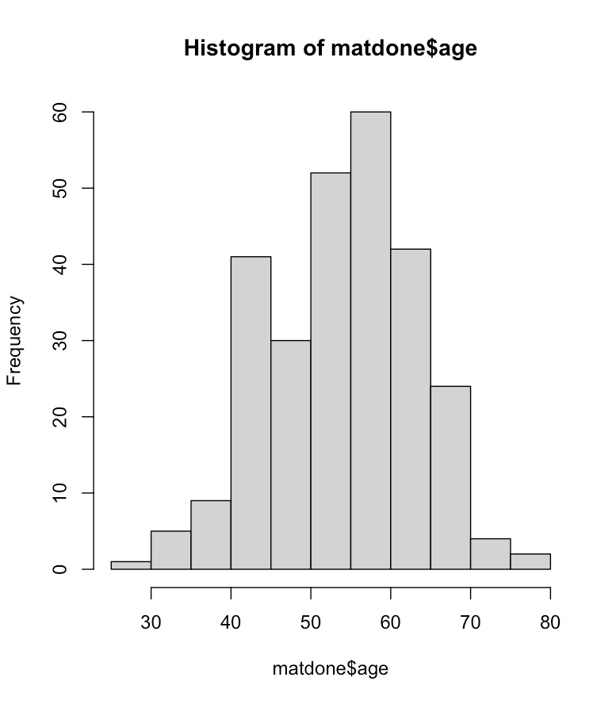
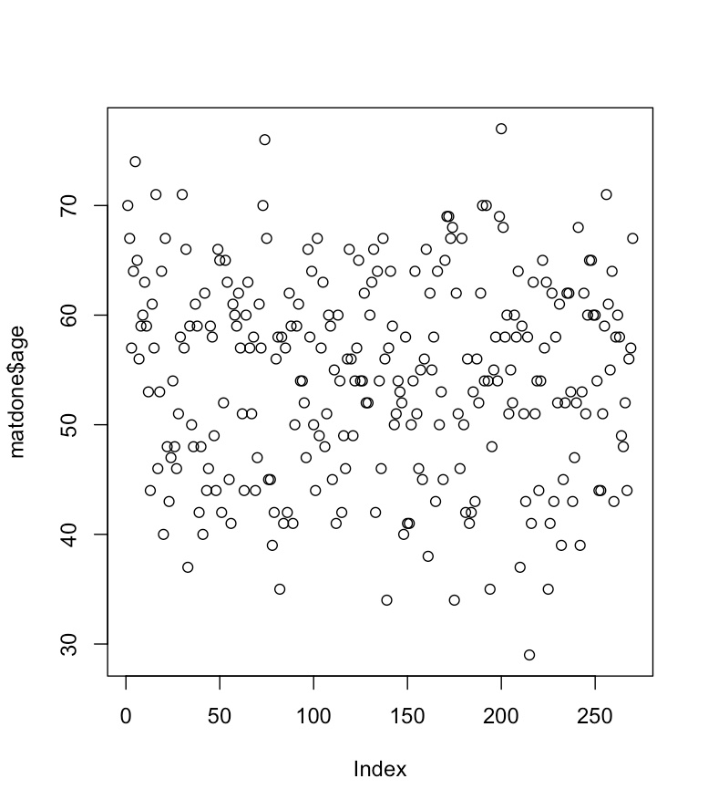
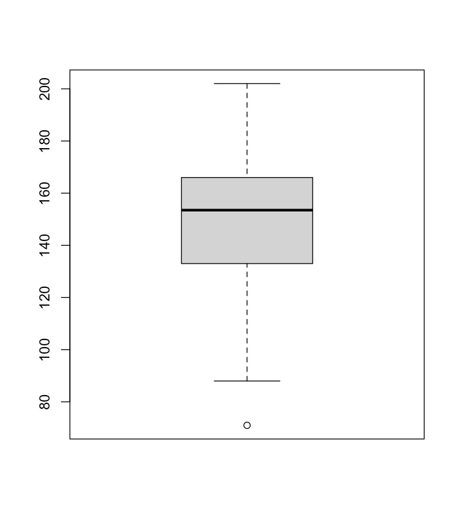
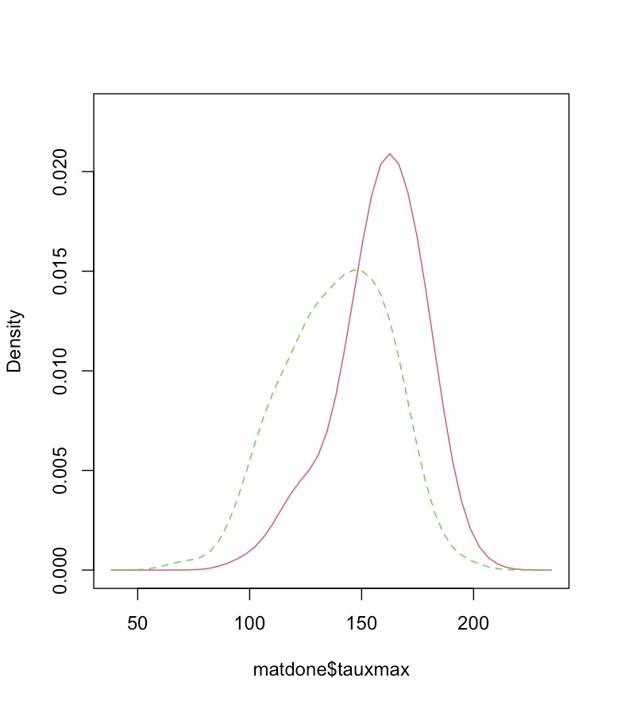
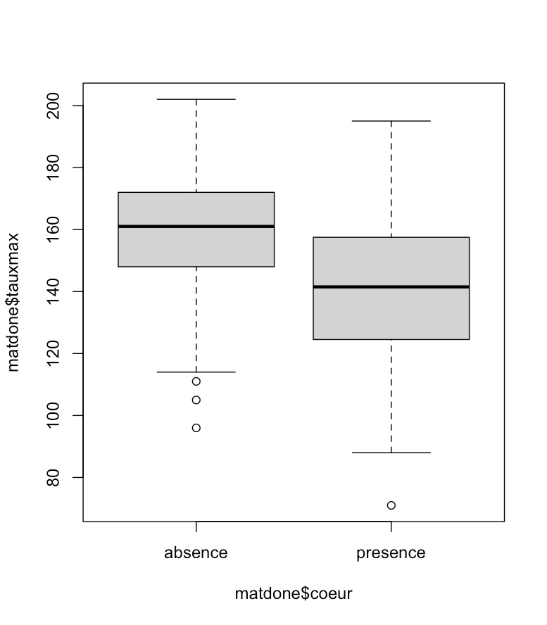
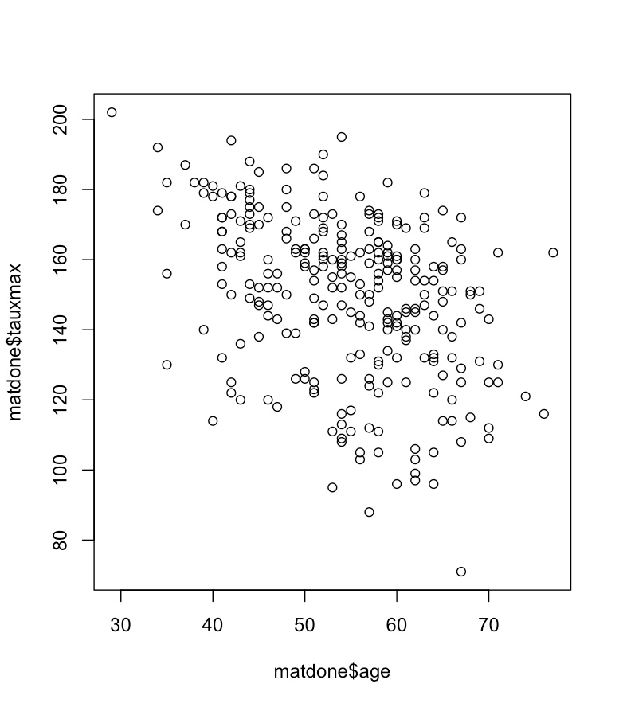
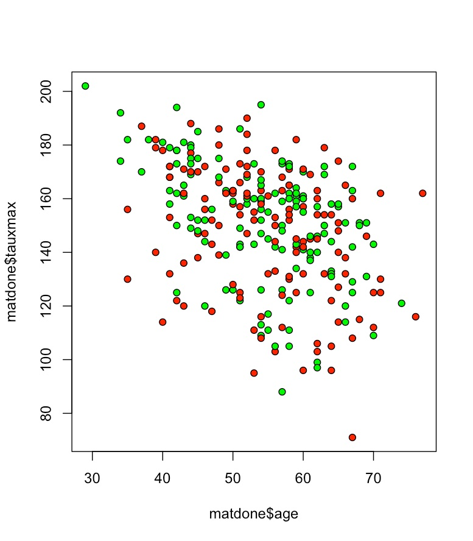

# 🫀 Heart Disease Analysis — R Exploratory Data Analysis

> **Auteur :** Bipanda Franck Ulrich  
> **Formation :** Mastère Data Engineering — Digital School of Paris (DSP)  
> **Date :** Février 2026  
> **Environnements :** R Console (macOS) & RStudio  
> **Dataset :** `heart.xlsx` — 270 observations × 8 variables

---

## 📋 Table des matières

- [Description du projet](#-description-du-projet)
- [Structure du dépôt](#-structure-du-dépôt)
- [Dataset](#-dataset)
- [Installation](#-installation)
- [Analyse et résultats](#-analyse-et-résultats)
- [Visualisations](#-visualisations)
- [Erreurs de saisie documentées](#-erreurs-de-saisie-documentées)
- [Comparaison R Console vs RStudio](#-comparaison-r-console-vs-rstudio)

---

## 📌 Description du projet

Analyse exploratoire d'un dataset médical sur les maladies cardiaques. L'objectif est d'explorer les relations entre les variables cliniques (âge, sexe, taux cardiaque maximum, angine...) et le diagnostic cardiaque (présence/absence).

Ce projet documente également de façon pédagogique les **erreurs de saisie commises** dans deux environnements R différents, avec leurs corrections.

---

## 📁 Structure du dépôt

```
heart-disease-analysis/
│
├── README.md                  # Ce fichier
├── heart_analysis.R           # Script R complet et corrigé
├── heart_analysis_errors.R    # Script documentant les erreurs de saisie
│
└── images/
    ├── fig1_hist_age.png          # Histogramme de l'âge
    ├── fig2_scatter_age.png       # Scatter plot âge par index
    ├── fig3_boxplot_tauxmax.png   # Boxplot taux cardiaque max
    ├── fig4_density_compare.png   # Densités comparées (sm)
    ├── fig5_boxplot_croise.png    # Boxplot croisé tauxmax ~ coeur
    ├── fig6_scatter_age_tauxmax.png  # Nuage de points âge vs tauxmax
    └── fig7_scatter_colore.png    # Nuage de points coloré
```

---

## 📊 Dataset

| Variable      | Type       | Description                              | Plage         |
|---------------|------------|------------------------------------------|---------------|
| `age`         | Numérique  | Âge du patient                           | 29 – 77 ans   |
| `sexe`        | Caractère  | Genre du patient                         | masculin / féminin |
| `typedouleur` | Caractère  | Type de douleur thoracique               | A, B, C, D    |
| `sucre`       | Caractère  | Glycémie à jeun                          | A / B         |
| `tauxmax`     | Numérique  | Taux cardiaque maximum atteint           | 71 – 202 bpm  |
| `angine`      | Caractère  | Angine induite à l'effort                | oui / non     |
| `depression`  | Numérique  | Dépression du segment ST                 | 0 – 62        |
| `coeur`       | Caractère  | Diagnostic final                         | présence / absence |

**Répartition :** 150 patients avec maladie cardiaque (55,6%) — 120 sans (44,4%)  
**Sexe :** 183 hommes (67,8%) — 87 femmes (32,2%)

---

## ⚙️ Installation

```r
# Installer les packages nécessaires
install.packages("openxlsx")   # Import fichier Excel
install.packages("sm")         # Graphiques de densité comparée

# Charger les librairies
library(openxlsx)
library(sm)

# Définir le répertoire de travail
setwd("/chemin/vers/votre/dossier")

# Importer le dataset
DF.FULL <- read.xlsx("heart.xlsx", sheet = 1)
```

> ⚠️ **Erreur fréquente :** toujours utiliser `library(sm)` AVANT d'appeler `sm.density.compare()`, sinon la fonction est introuvable.

---

## 📈 Analyse et résultats

### Statistiques descriptives

```r
dim(DF.FULL)      # 270 x 8
summary(DF.FULL)

# Moyennes d'âge par sexe
tapply(X = matdone$age, INDEX = matdone$sexe, mean)
# féminin  : 55.68 ans
# masculin : 53.84 ans

# Écart (max - min) par sexe
Ecart <- tapply(X = matdone$age, INDEX = matdone$sexe, function(x){max(x)-min(x)})
# féminin : 42 ans | masculin : 48 ans
```

### Table de contingence : Angine × Diagnostic

```
         absence  presence
  non       127       54
  oui        23       66
```

> 🔑 **Résultat clé :** parmi les patients souffrant d'angine induite à l'effort, **74,2 %** présentent une maladie cardiaque diagnostiquée.

```r
tabCroi <- table(matdone$angine, matdone$coeur)
print(tabCroi[2,2] / sum(tabCroi[2,]))  # → 0.7416
```

### Moyennes croisées : âge selon sexe et angine

```
              non      oui
féminin    55.72    55.50
masculin   52.63    55.76
```

### Filtrage du dataset

```r
# Patients de 40 ans ou moins → 15 individus
matdone[matdone$age <= 40, ]

# Patients de 70 ans et plus → 10 individus
matdone[matdone$age >= 70, ]

# Hommes de 34 ans et plus
matdone[matdone$age >= 34 & matdone$sexe == "masculin", ]
```

---

## 📊 Visualisations

### Figure 1 — Histogramme de l'âge
```r
hist(matdone$age)
```


> La majorité des patients se situe entre **50 et 60 ans**.

---

### Figure 2 — Distribution de l'âge par index
```r
plot(matdone$age)
```


---

### Figure 3 — Boxplot du taux cardiaque maximum
```r
boxplot(matdone$tauxmax)
```


> Médiane ≈ **153 bpm**. Outlier notable à **71 bpm**.

---

### Figure 4 — Courbes de densité comparée (package `sm`)
```r
library(sm)
sm.density.compare(matdone$tauxmax, matdone$coeur)
```


> Les patients **avec maladie cardiaque** (courbe verte pointillée) ont un tauxmax centré autour de **130–140 bpm**, contre **~160 bpm** pour les patients sains. Différence significative.

---

### Figure 5 — Boxplot croisé : tauxmax × diagnostic
```r
boxplot(matdone$tauxmax ~ matdone$coeur)
```


> Médiane **absence ≈ 160 bpm** vs **présence ≈ 140 bpm** — le `tauxmax` est un **indicateur discriminant fort**.

---

### Figure 6 — Nuage de points : âge vs tauxmax
```r
plot(matdone$age, matdone$tauxmax)
```


> Tendance négative visible : plus les patients sont âgés, plus leur tauxmax diminue.

---

### Figure 7 — Nuage de points coloré par diagnostic
```r
plot(matdone$age, matdone$tauxmax, pch = 21, bg = c("green", "red"))
# vert = absence | rouge = présence
```


> Les points **rouges** (malades) tendent à se concentrer dans les valeurs de tauxmax plus basses pour un même âge.

---

## ⚠️ Erreurs de saisie documentées

Ce projet documente les erreurs commises lors des deux sessions R, à titre pédagogique.

### Erreurs d'installation et chargement

| ❌ Saisie incorrecte | 💥 Erreur | ✅ Correction |
|---|---|---|
| `install.packages(sm)` | object 'sm' not found | `install.packages("sm")` |
| `install.packages("xlsx","openxlsx")` | lib= non accessible | Deux appels séparés |
| `libray(sm)` | could not find function "libray" | `library(sm)` |
| `sm.density.compare()` sans `library(sm)` | could not find function | Charger `library(sm)` d'abord |
| `sm.density.comparte()` | Faute de frappe | `sm.density.compare()` |

### Erreurs d'import du fichier

| ❌ Saisie incorrecte | 💥 Erreur | ✅ Correction |
|---|---|---|
| `setwd(/Users/.../Downloads)` | unexpected '/' | Ajouter les guillemets |
| `setwd(".../heart.xlsx")` | cannot change working directory | Pointer vers le **dossier**, pas le fichier |
| `read.xlsx(file="heart.xlsx", sheetubdex=1, header=T)` | unused arguments | `read.xlsx("heart.xlsx", sheet=1)` |
| `read.xlsx(file="heart.xlsx", sheet=1)` | unused argument (file=) | `read.xlsx("heart.xlsx", sheet=1)` |
| `print(coeur(DF.FULL))` | could not find function "coeur" | `DF.FULL$coeur` |
| `DF.FULL§coeur` | unexpected input | `DF.FULL$coeur` |

### Erreurs de filtrage et logique

| ❌ Saisie incorrecte | 💥 Erreur / Résultat | ✅ Correction |
|---|---|---|
| `matdone$age <= "40"` | Comparaison chaîne (guillemets) | `matdone$age <= 40` |
| `matdone[matdone$age <= 40]` | undefined columns selected | `matdone[matdone$age <= 40, ]` |
| `matdone(matdone$age <= "40")` | could not find function "matdone" | `matdone[matdone$age <= 40, ]` |
| `matdone[age<=40 & age>=70,]` | Condition logiquement impossible → 0 résultat | `matdone[age>=40 & age<=70, ]` |
| `legnth(matdone[...])` | could not find function "legnth" | `length(matdone[...])` |
| `histogram(matdone$age)` | could not find function "histogram" | `hist(matdone$age)` |
| `tapply(..., index=..., mean)` | unique() applies only to vectors | `tapply(..., INDEX=..., mean)` (majuscules) |
| `(matdone$age, matdone$tauxmax, pch=21,...)` | unexpected ',' | `plot(matdone$age, matdone$tauxmax, pch=21,...)` |

---

## 🔄 Comparaison R Console vs RStudio

La section de filtrage par âge est celle qui présente le plus de différences entre les deux environnements :

| Opération | R Console | RStudio | Différence |
|---|---|---|---|
| `age <= "40"` | ❌ Guillemets (chaîne) | ❌ Même erreur | Identique |
| Filtrage `age <= 40` | ✅ `matdone[age<=40,]` | ❌ `matdone(age<="40")` puis `matdone[age<=40]` | RStudio : 2 erreurs supplémentaires (parenthèses + virgule) |
| `age >= 70` | ❌ Guillemets | ❌ Même erreur | Identique |
| Condition impossible | ❌ `age<=40 & age>=70` | ❌ Même erreur | Identique |
| Correction finale | ✅ `age>=40 & age<=70` | ✅ `age>=40 & age<=70` | Identique |
| `length()` | ✅ Correct | ❌ `legnth()` (faute) | RStudio : faute de frappe supplémentaire |

---

## 🧠 Conclusions

1. **Le tauxmax est l'indicateur le plus discriminant** entre patients malades et sains
2. **74,2 % des patients avec angine** ont une maladie cardiaque confirmée
3. **Tendance négative** entre l'âge et le tauxmax : les patients plus âgés atteignent un taux cardiaque max plus faible
4. Les erreurs de type **comparaison numérique avec guillemets** (`age <= "40"`) et les **conditions logiquement impossibles** sont les plus fréquentes

---

## 📚 Technologies utilisées


**Packages R :** `openxlsx`, `sm`

---

*Bipanda Franck Ulrich — DSP Mastère Data Engineering — Février 2026*
